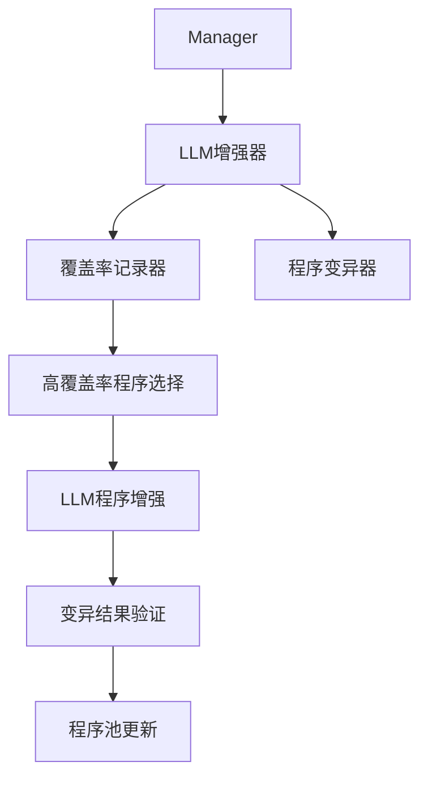
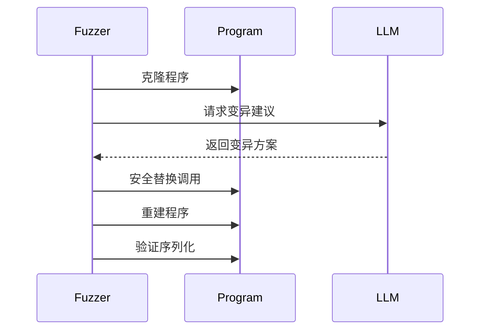
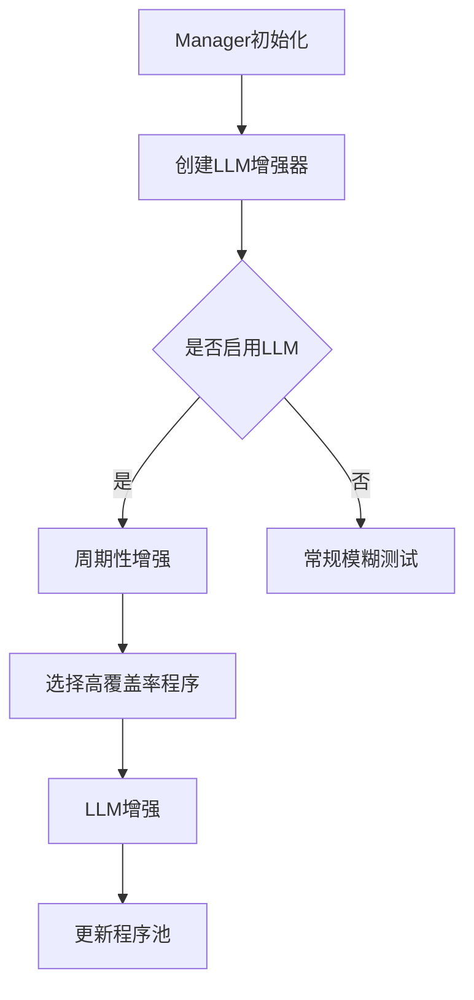
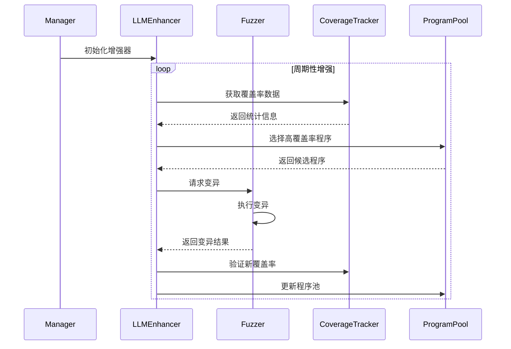

# Syzkaller LLM 增强系统改进文档

## 1. 总体架构

本次改进主要围绕在 Syzkaller 中引入 LLM (大语言模型) 增强功能，通过 LLM 来优化模糊测试过程。主要包含以下几个核心组件：



## 2. 核心改进内容

### 2.1 覆盖率统计系统 (pkg/fuzzer/cover.go)

新增了覆盖率计数功能：
- 添加 `Count()` 方法用于获取当前覆盖率
- 使用读写锁保护并发访问
- 实时统计最大信号覆盖情况

```go
func (cover *Cover) Count() int {
    cover.mu.RLock()
    defer cover.mu.RUnlock()
    return len(cover.maxSignal)
}
```

### 2.2 LLM 增强系统 (pkg/fuzzer/llm.go)

#### 2.2.1 程序变异改进
- 安全的系统调用替换机制
- 完整的错误处理和恢复机制
- 程序重建和验证流程

主要流程：
1. 程序克隆
2. 系统调用查找
3. 安全替换
4. 程序重建
5. 序列化验证



### 2.3 配置系统改进 (pkg/mgrconfig/config.go)

新增 LLM 相关配置：
- LLM API 访问配置
- 启用的系统调用配置
- 实验性功能配置

```go
type Config struct {
    // ... 现有配置 ...
    
    // LLM API 配置
    LLM string `json:"llm,omitempty"`
    
    // 启用的系统调用配置
    EnabledCalls map[string]bool `json:"-"`
    
    // 实验性配置
    Experimental Experimental
}
```

### 2.4 管理器改进 (syz-manager/fuzzer.go)

#### 2.4.1 LLM 增强集成
- 新增 LLM 增强器初始化
- 周期性增强处理
- 错误处理和日志记录



## 3. 安全性改进

### 3.1 错误处理
- panic 恢复机制
- 程序状态验证
- 安全的序列化处理

### 3.2 并发控制
- 使用互斥锁保护共享资源
- 原子操作保证数据一致性
- 安全的程序池访问

## 4. 性能优化

### 4.1 程序重建优化
- 渐进式重建策略
- 失败时的回退机制
- 资源使用优化

### 4.2 缓存机制
- 系统调用缓存
- 变异结果缓存
- 覆盖率数据缓存

## 5. 接口改进

### 5.1 新增接口
- LLM 配置接口
- 覆盖率统计接口
- 程序变异接口

### 5.2 改进的接口
- 程序序列化接口
- 错误处理接口
- 日志记录接口

## 6. 工作流程

完整的 LLM 增强工作流程如下：



## 7. 未来改进方向

1. 更智能的程序选择算法
2. 更高效的变异策略
3. 分布式 LLM 处理支持
4. 更多的安全性保障
5. 更好的性能优化

## 8. 总结

本次改进通过引入 LLM 增强系统，显著提升了 Syzkaller 的模糊测试能力。主要亮点包括：

1. 智能的程序变异
2. 精确的覆盖率跟踪
3. 安全的执行机制
4. 高效的资源利用
5. 完善的错误处理

这些改进使 Syzkaller 能够更智能、更高效地发现系统漏洞，同时保持了系统的稳定性和可靠性。
